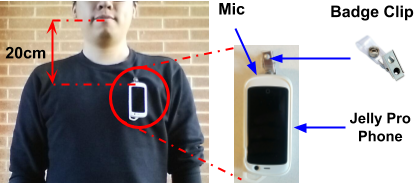

# TILES AUDIO RECORDER
### - NOT FOR COMMERCIAL USE - Library credit to openSMILE team

The repo is for TILES AUDIO RECORER Android application    
Author: Tiantian Feng  
Contact: tiantiaf@usc.edu    

Notice: We are constantly updating and cleaning our TILES AUDIO RECORER Android application for a future release. If you are interested in certain features in our application, please send me the email, and I will get back to you ASAP. Note this code is used for more generalized purpose, thus certain specific features and functions presented in our paper/data collection may be removed. The figure below showed the hardware setup we used for our research. The current code works for the Android system 8.0.

  
   

================
### Code Setup

Step1: Download Android Studio, openSMILE and Android NDK

Step2: Follow openSMILE handbook to setup openSMILE lib folder and NDK folder location in project files

Step3: Update your own Amazon keys in Constant.Java if you want to monitor the data collection process from your Amazon S3 server

Step4: Hit run in Android studio and hope all is good

================
### Usage Notice

### 0: Very important, remove the system settings that disable the app to run in the background, or battery optimization. Every Android system is slightly different .

#### 1: We keep the QR code scan procedure in our application, so it would be easy for researcher to manage the enrollment. The QR code string will be the participant id. The QR code string should contain 'tar' if the QR code scan code is not modified. For example QR code string tar0001 will look like:

  
   

#### 2: The BLE functions are currently partially working, to be able to scan nearby bluetooth device, simply add your device id in the Constant files.

#### 3: Update your own Amazon s3 credentials in Constant.Java if you want to monitor the data collection process from your Amazon S3 server, it is fully automatic as long as the device connects to the Internet!

#### 4: Recording will be initiated every 60 seconds, with a duration selected by participants.

#### 5: Update the features that you need under TILEs_phase2_core_lld. The default config file disables the saving for raw audio.

================

### References

<a id="1">[1]</a> 
Feng, Tiantian, et al. (2018). 
Tiles audio recorder: an unobtrusive wearable solution to track audio activity.
Proceedings of the 4th ACM Workshop on Wearable Systems and Applications.
 
<a id="1">[2]</a> 
Eyben, Florian, Martin Wöllmer, and Björn Schuller (2010). 
Opensmile: the munich versatile and fast open-source audio feature extractor.
Proceedings of the 18th ACM international conference on Multimedia.
